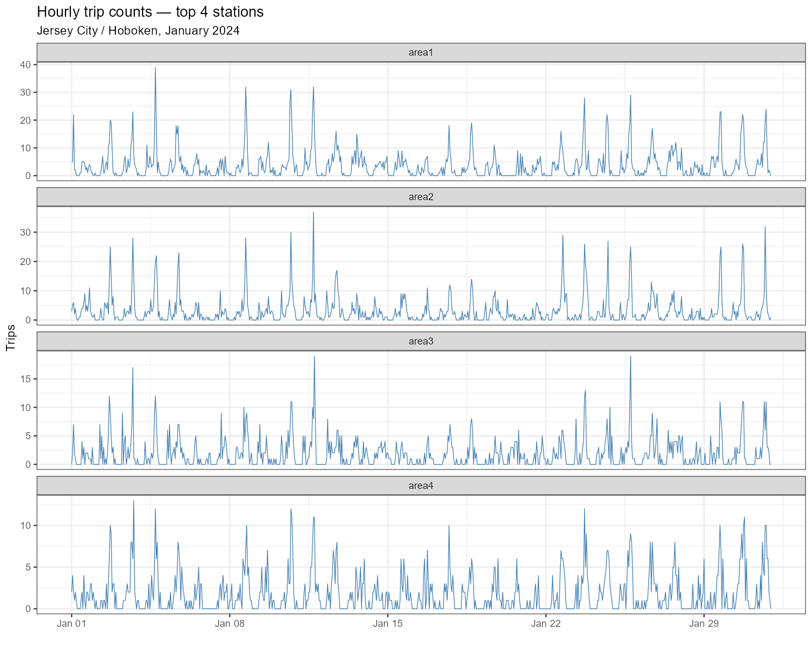
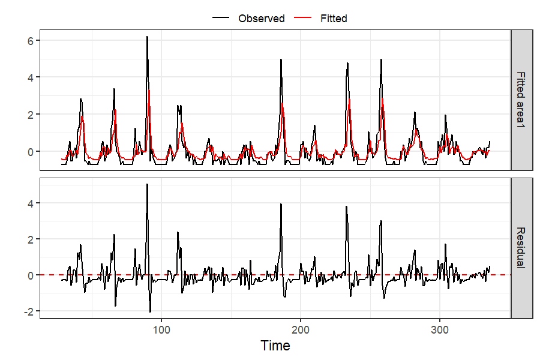
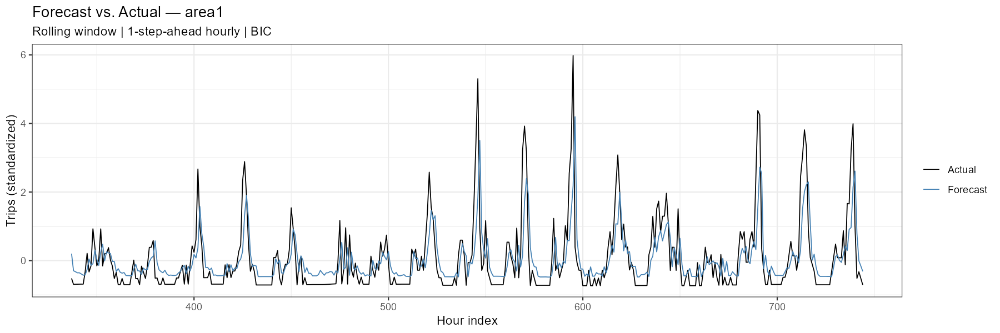

# STARX
Spatio-temporal autogression with exogenous variables

Sparse VAR baseline on Citi Bike station-level demand data.  
This repository documents the data pipeline, model setup, and rolling window forecast evaluation as a foundation for the STARX extension.

---

## Data

**Source:** [Citi Bike System Data](https://s3.amazonaws.com/tripdata/index.html)  
**Coverage:** Jersey City / Hoboken, January 2024  
**Raw trips:** ~50,600 individual rides  
**Stations:** Top 4 by trip volume (labeled `area1`–`area4`)  
**Resolution:** 1-hour intervals → 744 hours × 4 stations

Data files are not included in this repository. The script downloads them automatically on first run.

---

## Method

### Time Series Construction

Each ride is assigned to its hourly interval via `floor_date()`. Trip counts are aggregated per station and interval; missing combinations (zero rides) are filled with 0 to produce a complete rectangular matrix. Hourly aggregation reduces noise compared to 30-minute intervals and produces a cleaner signal for VAR estimation.

### Model

Sparse VAR with hierarchical lag penalty (HLag) from the [`bigtime`](https://github.com/ineswilms/bigtime) package:

```
Y_t = A_1 Y_{t-1} + A_2 Y_{t-2} + ... + A_p Y_{t-p} + ε_t
```

- Penalty: `HLag` — encourages whole lags to drop out before individual coefficients
- Selection: `bic` 
- Standardization: `scale()` fit on each window separately — no data leakage

### Rolling Window Evaluation

```
|←— 336 hours (2 weeks) —→| t+1
            |←— 336 —→| t+2
                            ...
```

| Parameter | Value |
|-----------|-------|
| Window size | 336 hours (2 weeks) |
| Forecast horizon | h = 1 (1 hour ahead) |
| Test points | 408 hours |
| Forecast function | `directforecast(h = 1)` |

Actuals and naive baseline are standardized using the same window parameters (`mu`, `sd`) as the forecast — ensuring all metrics are computed in a consistent standardized space.

### Baseline

Naive forecast: last observed value within the training window, standardized with window parameters.

---

## Results

### Raw Time Series



Hourly trip counts for the top 4 stations across January 2024. All stations show a clear daily rhythm with morning and evening peaks. area1 and area2 are the busiest stations, reaching up to 40 trips/hour. The regular weekly pattern (lower demand on weekends) is visible throughout.


### Model Diagnostics — area1



In-sample fit on the initial 2-week training window. The fitted values (red) follow the observed signal (black) closely — daily peaks and nighttime lows are well captured. Residuals are centered around zero and substantially smaller than the raw signal, indicating good in-sample fit.

---

### Forecast Accuracy by Station

| Station | MSFE (VAR) | MSFE (Naive) | Improvement | MAE (VAR) |
|---------|-----------|-------------|-------------|-----------|
| area1 | 0.5630 | 0.6201 | 9.2% | 0.4990 |
| area2 | 0.5782 | 0.7464 | 22.5% | 0.4570 |
| area4 | 0.6225 | 0.8882 | 29.9% | 0.5675 |
| area3 | 0.6345 | 1.0171 | 37.6% | 0.5394 |
| **overall** | **0.5996** | **0.8180** | **26.7%** | **0.5157** |

MSFE and MAE values are in standardized scale. VAR outperforms the naive baseline on all 4 stations.

---

### Forecast vs. Actual — area1



The 1-step-ahead forecast (blue) tracks the actual demand (black) closely across the full test period. Daily peaks and nighttime lows are well reproduced. 

---

## Repository Structure

```
STARX/
├── README.md
├── Literature/
├── R/
│   └── citibike_sparseVAR_rolling_v2.R
└── plots/
    ├── plot_series.png
    ├── plot_lagmatrix.png
    ├── plot_diagnostics.png
    └── plot_forecast.png
```

---

## Dependencies

```r
install.packages(c("bigtime", "ggplot2", "dplyr", "tidyr", "lubridate", "openxlsx"))
```

R version used: 4.4.1
