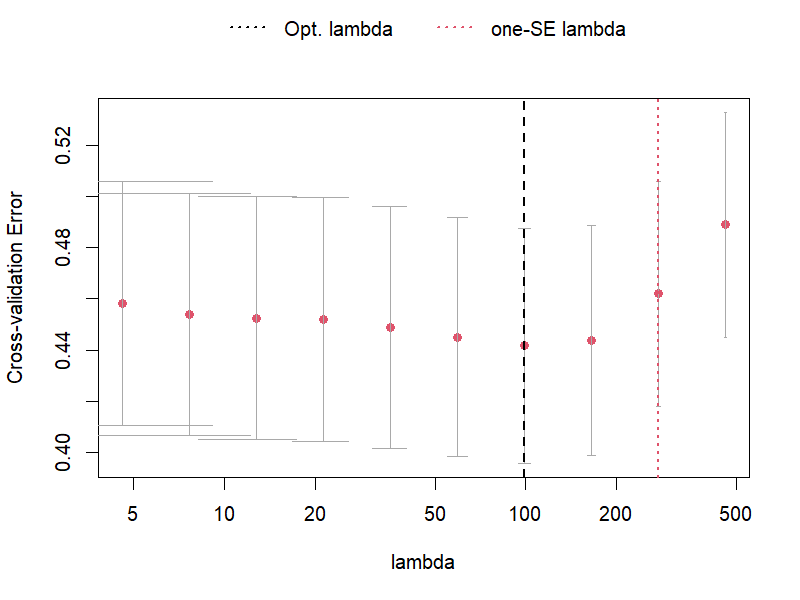
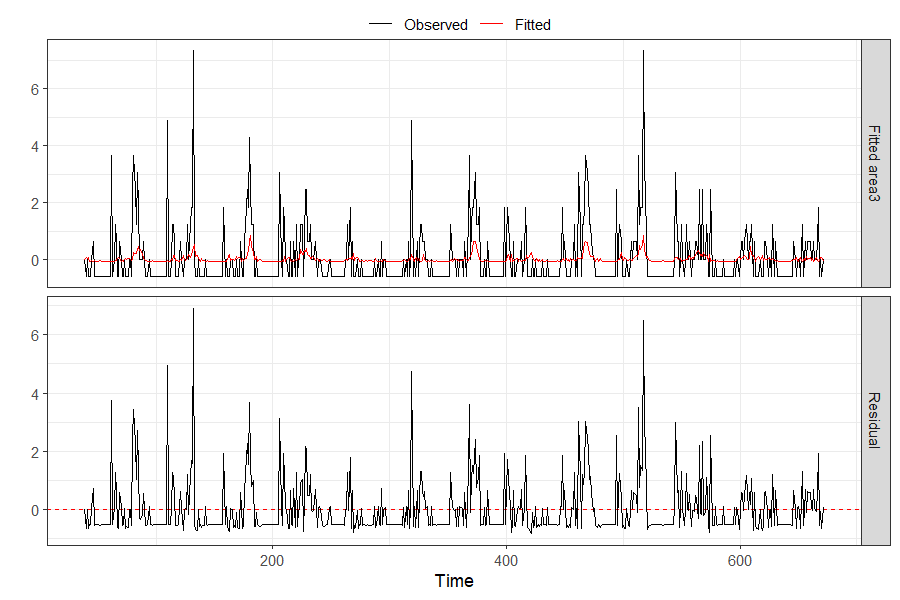
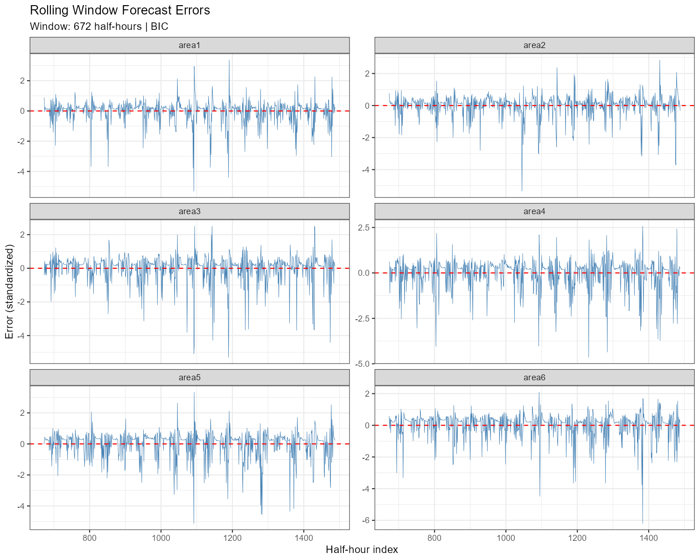
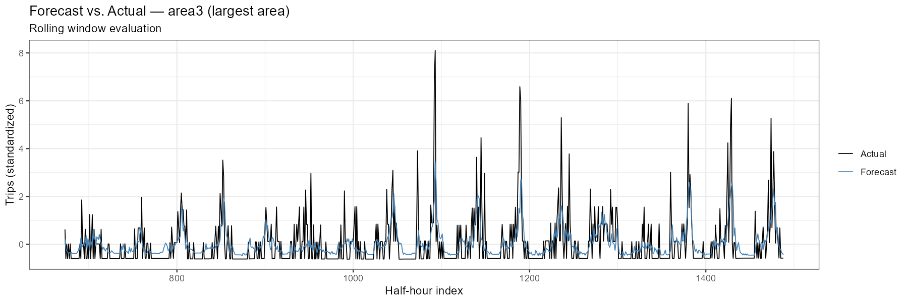

# STARX
Spatio-temporal autogression with exogenous variables
# STARX — Spatio-Temporal AutoRegression with Exogenous Variables

Sparse VAR baseline on Citi Bike station-level demand data (Jersey City / Hoboken).  
This repository documents the data pipeline, model setup, and rolling window forecast evaluation as a foundation for the STARX extension with spatial penalties and exogenous variables.

---

## Data

**Source:** [Citi Bike System Data](https://s3.amazonaws.com/tripdata/index.html)  
**Coverage:** Jersey City / Hoboken, January 2024  
**Raw trips:** ~50,600 individual rides  
**Stations:** Top 6 by trip volume (labeled `area1`–`area6`)  
**Resolution:** 30-minute intervals → 1,488 half-hours × 6 stations

Data files are not included in this repository. The script downloads them automatically on first run.

---

## Method

### Time Series Construction

Each ride is assigned to its 30-minute interval via `floor_date()`. Trip counts are aggregated per station and interval; missing combinations (zero rides) are filled with 0 to produce a complete rectangular matrix.

### Model

Sparse VAR with hierarchical lag penalty (HLag) from the [`bigtime`](https://github.com/ineswilms/bigtime) package:

```
Y_t = A_1 Y_{t-1} + A_2 Y_{t-2} + ... + A_p Y_{t-p} + ε_t
```

- Penalty: `HLag` — encourages whole lags to drop out before individual coefficients
- Initial fit: `selection = "cv"` (time series cross-validation)
- Rolling window: `selection = "bic"` for computational feasibility
- Standardization: `scale()` fit on each window separately — no data leakage

### Rolling Window Evaluation

```
|←— 672 half-hours (2 weeks) —→| t+1
                  |←— 672 —→| t+2
                                  ...
```

| Parameter | Value |
|-----------|-------|
| Window size | 672 half-hours (2 weeks) |
| Forecast horizon | h = 1 (30 minutes ahead) |
| Test points | 816 half-hours |
| Forecast function | `directforecast(h = 1)` |

Actuals and naive baseline are standardized using the same window parameters (`mu`, `sd`) as the forecast — ensuring all metrics are computed in a consistent standardized space.

### Baseline

Naive forecast: last observed value within the training window, standardized with window parameters.

---

## Results

### Cross-Validation Curve



Optimal lambda ≈ 100 (black dashed line). The CV curve is relatively flat between λ = 5 and λ = 100, indicating the model is not highly sensitive to regularization strength in this range. The one-SE lambda (~250) selects a sparser model within one standard deviation of the optimum.

---

### Model Diagnostics — area3



In-sample fit on the initial training window. The fitted values (red) capture the baseline level but miss most large spikes — consistent with a linear model applied to count data with rare high-demand events. Residuals closely resemble the raw signal, indicating limited explained variance in-sample for this station.

---

### Forecast Accuracy by Station

| Station | MSFE (VAR) | MSFE (Naive) | Improvement |
|---------|-----------|-------------|-------------|
| area2 | 0.5073 | 0.6830 | 25.7% |
| area1 | 0.5353 | 0.7259 | 26.3% |
| area6 | 0.6137 | 1.0889 | 43.6% |
| area3 | 0.7023 | 1.1752 | 40.2% |
| area4 | 0.7337 | 1.2121 | 39.5% |
| area5 | 0.7473 | 1.1386 | 34.4% |
| **overall** | **0.6400** | **1.0039** | **36.3%** |

MSFE values are in standardized scale. VAR outperforms the naive baseline on all 6 stations.

---

### Rolling Window Forecast Errors



Errors are centered around zero across all six stations — no systematic bias. Large positive outliers dominate, meaning the model consistently underestimates demand spikes. This is expected behavior for a linear VAR without calendar or weather information. `area4` shows the largest outliers, suggesting more irregular demand patterns at that station.

---

### Forecast vs. Actual — area3



The 1-step-ahead forecast (blue) tracks the daily demand cycle well but undershoots sharp peaks. The model captures the general level and periodicity of demand; extreme values remain difficult to predict without exogenous information.

---

## Repository Structure

```
STARX/
├── README.md
├── Literature/
├── R/
│   └── citibike_sparseVAR_rolling.R
└── plots/
    ├── 03_cv_curve.png
    ├── 05_forecast_errors.png
    ├── 06_forecast_vs_actual_area3.png
    └── 08_diagnostics_area3.png
```

---

## Dependencies

```r
install.packages(c("bigtime", "ggplot2", "dplyr", "tidyr", "lubridate", "openxlsx"))
```

R version used: 4.4.1

